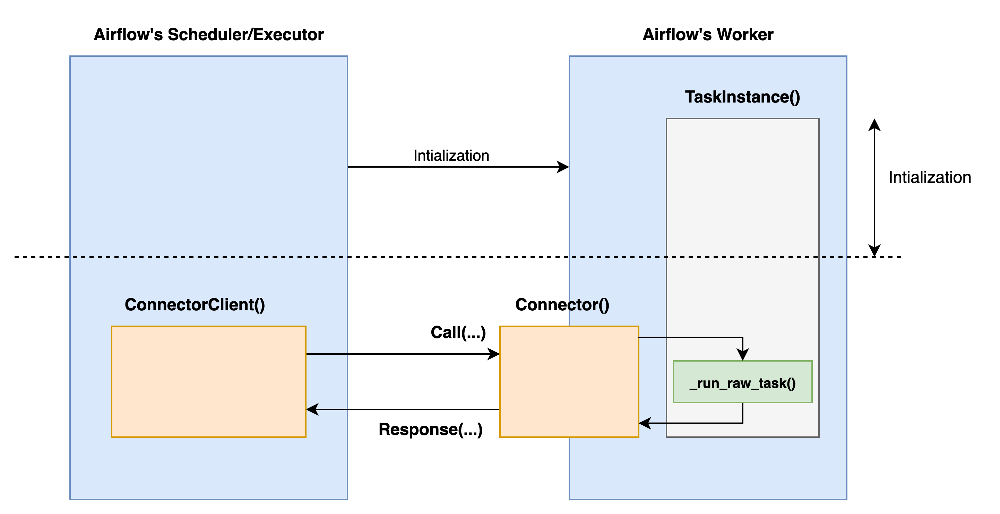

# H2C Connector

## Main Objects
- [class] `Connector`: An intermediary for communication, used for workers.
   - When request is occurred, `Connector` delivers the request to the `task instance` method function.
   - It also converts the message (gRPC protobuf-type) to dict-type data when request is occurred, automatically.
   - When task instance is complete, it converts responses/outputs (dict-type data) to the message (gRPC protobuf-type) and returns it to scheduler.
- [class] `ConnectorClient`: An object for communication, used for scheduler.
   - Provides an easy-to-use abstract method, such as `request(payloads=...)`.
   - **Note** You need to know the url of `Connector` before communtication.
- [function] `connect_ti_function()`: A function for attaching `Connector` to `task instance` method function.
